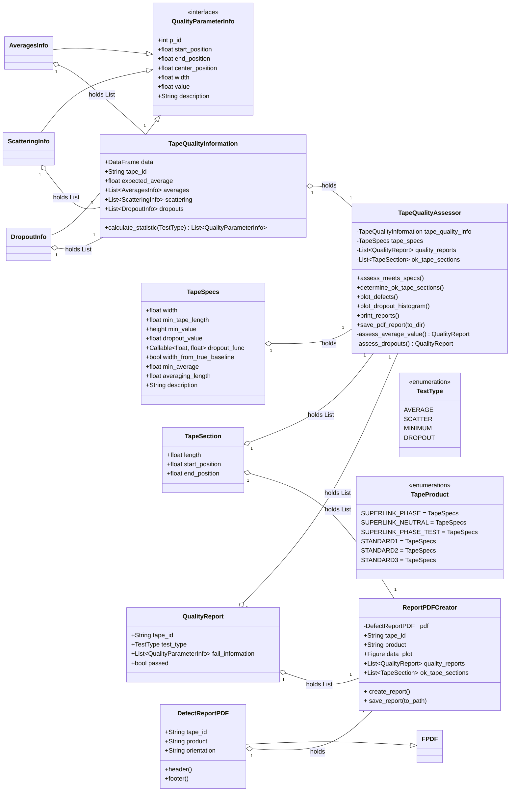

# Class Diagram

```mermaid
classDiagram
direction RL

class TapeQualityAssessor{
    -TapeQualityInformation tape_quality_info
    -TapeSpecs tape_specs
    -List~QualityReport~ quality_reports
    -List~TapeSection~ ok_tape_sections

    +assess_meets_specs()
    +determine_ok_tape_sections()
    +plot_defects()
    +plot_dropout_histogram()
    +print_reports()
    +save_pdf_report(to_dir)

    -assess_average_value() QualityReport
    -assess_dropouts() QualityReport
}

class TapeQualityInformation{
    +DataFrame data
    +String tape_id
    +float expected_average
    +List~AveragesInfo~ averages
    +List~ScatteringInfo~ scattering
    +List~DropoutInfo~ dropouts

    +calculate_statistic(TestType) List~QualityParameterInfo~
}

class QualityParameterInfo{
    <<interface>>
    +int p_id
    +float start_position
    +float end_position
    +float center_position
    +float width
    +float value
    +String description
}

class AveragesInfo
class ScatteringInfo
class DropoutInfo

class TapeSpecs{
    +float width
    +float min_tape_length
    +height min_value
    +float dropout_value
    +Callable~float, float~ dropout_func
    +bool width_from_true_baseline
    +float min_average
    +float averaging_length
    +String description
}

class TestType{
    <<enumeration>>
    AVERAGE
    SCATTER
    MINIMUM
    DROPOUT
}

class TapeSection{
    +float length
    +float start_position
    +float end_position
}

class QualityReport{
    +String tape_id
    +TestType test_type
    +List~QualityParameterInfo~ fail_information
    +bool passed
}

class TapeProduct{
    <<enumeration>>
    SUPERLINK_PHASE = TapeSpecs
    SUPERLINK_NEUTRAL = TapeSpecs
    SUPERLINK_PHASE_TEST = TapeSpecs
    STANDARD1 = TapeSpecs
    STANDARD2 = TapeSpecs
    STANDARD3 = TapeSpecs
}

class FPDF

class DefectReportPDF{
    +String tape_id
    +String product 
    +String orientation

    +header()
    +footer()
}

class ReportPDFCreator{
    -DefectReportPDF _pdf

    +String tape_id
    +String product
    +Figure data_plot
    +List~QualityReport~ quality_reports
    +List~TapeSection~ ok_tape_sections

    + create_report()
    + save_report(to_path)
}

FPDF <|-- DefectReportPDF
QualityParameterInfo <|-- AveragesInfo
QualityParameterInfo <|-- ScatteringInfo
QualityParameterInfo <|-- DropoutInfo

TapeQualityInformation "1" --o "1" AveragesInfo : holds List
TapeQualityInformation "1" --o "1" ScatteringInfo : holds List
TapeQualityInformation "1" --o "1" DropoutInfo : holds List

TapeQualityAssessor "1" --o "1" TapeQualityInformation : holds
TapeQualityAssessor "1" --o "1" TapeSpecs : holds
TapeQualityAssessor "1" --o "1" QualityReport : holds List
TapeQualityAssessor "1" --o "1" TapeSection : holds List

ReportPDFCreator "1" --o "1" DefectReportPDF : holds
ReportPDFCreator "1" --o "1" QualityReport : holds List
ReportPDFCreator "1" --o "1" TapeSection : holds List
```